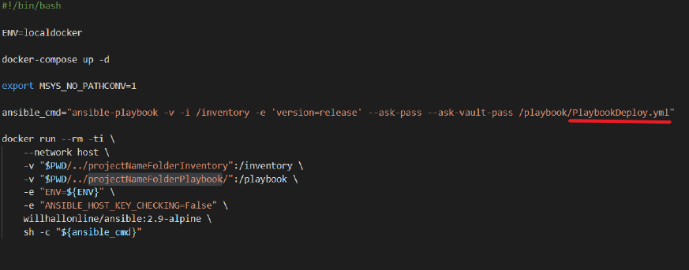

# RASPBERRY-ANSIBLE TEST ENVIRONMENT

> A virtualized test environment where you can test your ansible playbooks on 3 full ARM based Raspberry Pi virtual machines


The project has the following architecture, where we have a container with everything necessary to run the ansible playbooks and three other Raspberry Pi containers that will be the target of the playbooks.

<div align="center">
	
</div>


## STACK

1. Windows (host OS)
2. Docker Desktop
3. Docker Compose
4. Ansible (containerized inside Docker)
5. Jenkins (containerized inside Docker) --> ONLY FULL BRANCH
6. QEMU (containerized inside Docker)
7. Raspbian (containerized inside QEMU)

## BRANCHES

Lite Version is a minimal operating system. It only has Command Line Interface so requires a very low amount of RAM and CPU usage.

* `master` The master branch, includes an Ansible Alpine container + 3 Raspbian 9.8-Stretch-lite containers


Full Version comes with a default Graphical User Interface so even if optimized it requires anyway addicting packages and software, RAM and CPU usage will result increased if compared to Lite version.

* `9.8-Stretch-Full` Includes an Ansible-Jenkins container  + 3 Raspbian 9.8-Stretch containers


## REQUIREMENTS

  HARDWARE:
  
	  Free Space:

		   + Lite Version

			8.05 GB for Raspberry image + 1.35 GB Ansible image

		   + Full Version

			15 GB for Raspberry image + 1.35 GB Ansible image

	  RAM:
	 	   + Mínimum 4GB RAM
  
  SOFTWARE:
  + Docker_Desktop

  + WSL2

  + Visual_Studio_Code
  
  You can install these tools by running the script:
  
  ```
  ./requirements.ps1
  ```

## INSTALL FOR THE MASTER BRANCH


1. The first step is to download the test environment and create a workspace folder.

2. The second step is to clone our ansible project in this workspace. As a result, we should have
something like this

<div align="center">
	
</div>

3. The third step is to open the folder "Raspberry-Ansible-Test-Environment-9.8-Stretch-Lite", and
open the file “run.sh” with an editor such as Visual Studio.

4. Once this file is opened, on the one hand we have to change "projectNameFolderInventory"
highlighted in the following figure , by the path of our inventory, (location of the hosts file).

<div align="center">
	
</div>


5. In the same way, we have to change "projectNameFolderPlaybook" highlighted in the figure 4,
by the path of the folder that contains the playbook. You also have to change the name of the
playbook, underlined in red in the following figure.

<div align="center">
	
</div>

6. Then run the sh script, running the following command
./run.sh

7. The default access credentials of the raspberry are the following
user=pi
pass=raspberry
When the terminal asks for the ssh password, enter "raspberry" as the password.
In the same way, enter the Vault key. If you don't have a Vault key, remove the following option in run.sh

<div align="center">
	
</div>


8. Finally the playbook will run. You can make changes to the project and re-launch the
script run.sh, since the project folders are mapped and any changes you make will be applied
automatically.

9. On the other hand, you can manually access the raspberries. Using docker exec or Docker Desktop

10. Once the terminal opens, you can launch ssh.For example
ssh -2222 pi@localhost

<div align="center">
	
</div>

11. Now you can check the playbook changes manually


+ Additionally

You can use another Ansible image, changing it in the run script

<div align="center">
	
</div>

I recommend the following repositories

[@William-Yeh](https://github.com/William-Yeh/docker-ansible)

[@cytopia](https://github.com/cytopia/docker-ansible)

## INSTALL FOR THE 9.8-Stretch-Full BRANCH


1. The first step is to go to the '\ansible\projectToTest' folder of the repository. Here you can clone your Ansible project. 
This folder is mapped to the '/home/projectToTest/' folder of the ansible container, so any changes you make, will be applied immediately to the container.

<div align="center">
	
</div>


2. In the same way, the 'ansible\ansible_cfg' folder is mapped to the ansible configuration folder '/etc/ansible/'. 

<div align="center">
	
</div>

By default in the ansible.cfg file we have host_key_checking = False 


3. Open a terminal, and run:

```
sudo docker-compose up -d
```

4. Once the containers are deployed. You can access the Ansible container terminal using docker desktop or from the following command:

```
docker exec -it ansible /bin/bash
```

5. Finally you can run your Ansible project or test the connection to a raspberry using ssh command:

```
ssh -p 2222 -o UserKnownHostsFile=/dev/null -o StrictHostKeyChecking=no pi@raspberry1
or
ssh -p 2222 pi@raspberry2
```

The default access credentials of the raspberry are the following

	user=pi
	pass=raspberry


## HOW TO CHECK KERNEL AND RASPBERRY IMAGE VERSIONS

A full ARM environment is created by using Docker to bootstrap a QEMU virtual machine. 
The official Raspbian image is mounted and booted along with a modified QEMU compatible kernel.

You can check the version of the Kernel used with the following command

pi@raspberrypi:~ $ ```uname -a```

	Linux raspberrypi 4.14.79+ #1 Tue Nov 26 01:41:58 CET 2019 armv6l GNU/Linux

Also you can check the version of Raspbian used with the following command

pi@raspberrypi:~ $ ```lsb_release -a```

	No LSB modules are available.
	Distributor ID: Raspbian
	Description:    Raspbian GNU/Linux 9.8 (stretch)
	Release:        9.8
	Codename:       stretch


## RESOURCES

Kernel [4.14.79-stretch](https://github.com/dhruvvyas90/qemu-rpi-kernel/blob/061a3853cf2e2390046d163d90181bde1c4cd78f/kernel-qemu-4.14.79-stretch) used

Image [stretch-9.8](https://downloads.raspberrypi.org/raspbian_lite/images/raspbian_lite-2019-04-09/) used


## CREDIT

Thanks to

[@Maghin](https://github.com/Maghin) for his help, recommendations and best practices

[@hannseman](https://github.com/hannseman/docker-raspbian) for [docker-raspbian](https://github.com/hannseman/docker-raspbian) repo.

[@dhruvvyas90](https://github.com/dhruvvyas90) for [qemu-rpi-kernel](https://github.com/dhruvvyas90/qemu-rpi-kernel) repo.

[@lukechilds](https://github.com/lukechilds) for [dockerpi](https://github.com/lukechilds/dockerpi) repo.

[@dastergon](https://github.com/dastergon) for [ansible-rpi-cluster](https://github.com/dastergon/ansible-rpi-cluster) repo.

[@mrhavens](https://github.com/mrhavens) for [pidoc](https://github.com/mrhavens/pidoc) repo.

[@William-Yeh](https://github.com/William-Yeh/docker-ansible) for Ansible Docker Image

[@cytopia](https://github.com/cytopia/docker-ansible) for Ansible Docker Image

